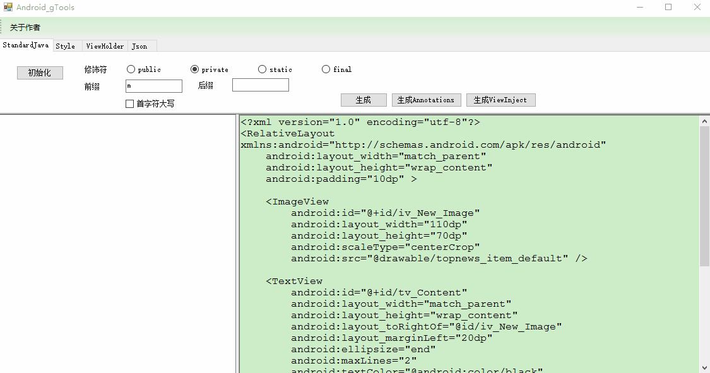
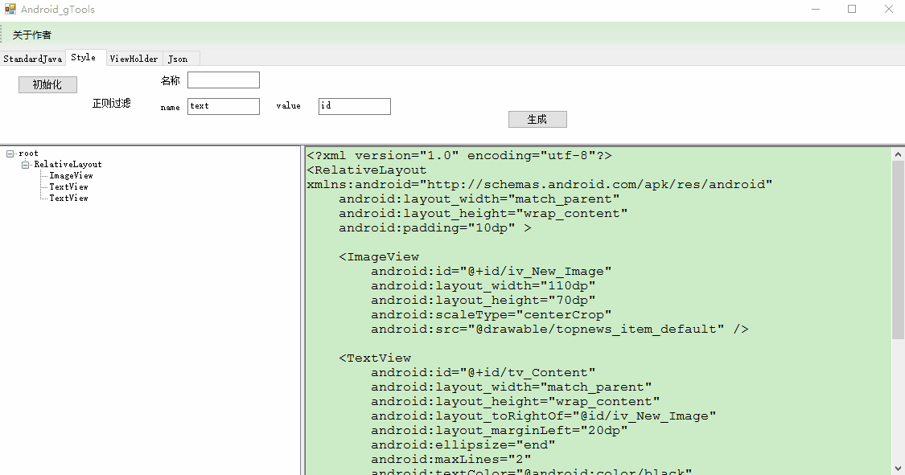
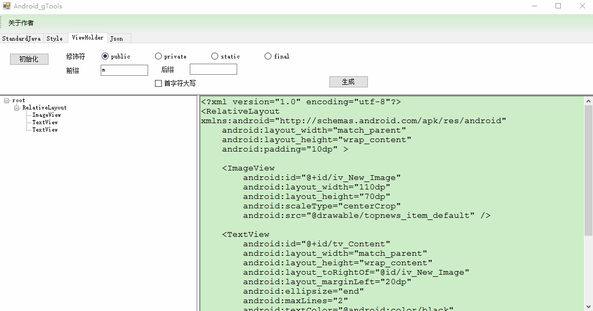
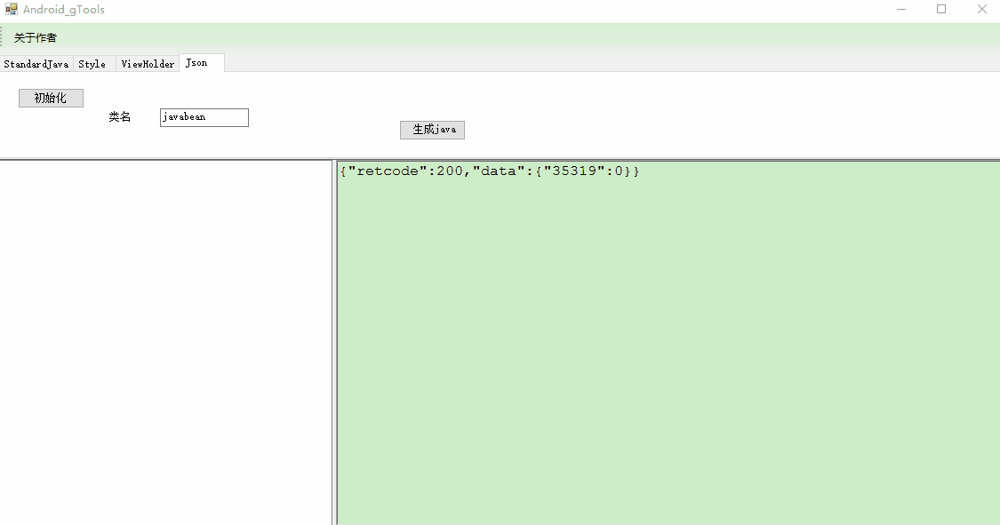
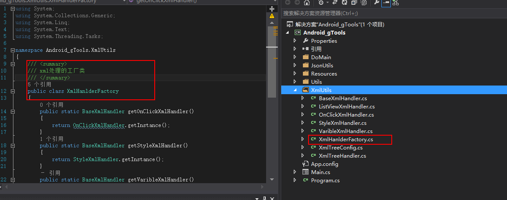

# Android_gTools
Android 布局xml解析代码生成工具
[相关文章](http://keyboard3.leanote.com/post/Android%E8%BE%85%E5%8A%A9%E5%B7%A5%E5%85%B7-Android-gTools-2)

## 介绍
### 生成绑定控件的代码
标准版：findViewById
Xutils注入版、Annotations注入版
 
### 生成Style文件的代码
可以根据正则表达式筛选过滤到style中的属性。分xml结点name和value都可以参正则过滤
 
### 生成Viewholder相关
 
### json数据生成java类
 
## 下载
* 下载[Android_gTools_v0.0.4.exe](./Android_gTools_v0.0.4.exe)  

## 框架
因为我们的功能都是同一类型，根据xml解析，所以我们可以将每个功能看成一类产品，而我们采用一个简单简单工程进行管理这些产品的生成。每个功能对象都是唯一的，所以我们需要采用单例保证唯一性。
所以真个架构我采用了简单工厂+工厂方法+单例来实现整个项目。
 
